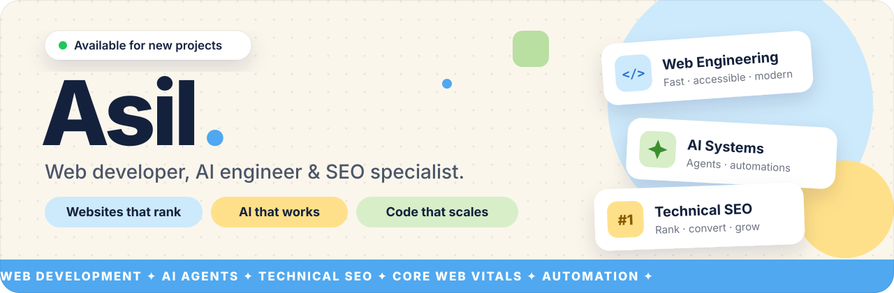
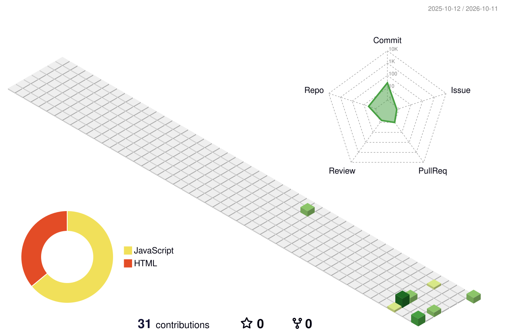

  

  <a href="mailto:infoaurasil@gmail.com">Email</a> &nbsp;·&nbsp;
  <a href="https://instagram.com/asilsheikh">Instagram</a> &nbsp;·&nbsp;
  <a href="https://t.me/asilsheikh">Telegram</a> &nbsp;·&nbsp;
  

 

I'm Asil, a developer who builds **web products that load fast and rank**, and **AI systems that automate real work**. I care about performance, search visibility and code that's easy to maintain.

### Focus

| Discipline | Scope |
|:--|:--|
| **Web Engineering** | Responsive, accessible websites and web apps built for speed and long-term maintainability. |
| **AI Systems** | Agents, assistants and automations that remove repetitive work from a business. |
| **Technical SEO** | Site structure, structured data, Core Web Vitals and content that earns rankings. |

### Tools I use

  

| Area | Tools |
|:--|:--|
| AI | Gemini API · ElevenLabs · OpenAI Agents SDK · CrewAI · LangGraph · MCP |
| SEO & Performance | Google Search Console · Lighthouse · Schema.org |

### Featured project

<table>
  <tr>
    <td>
      <h3><a href="https://fsp-trainer-six.vercel.app">FSP Trainer</a></h3>
      
An exam-prep platform for dentists moving to Germany. Users practice the <b>FSP (Fachsprachprüfung)</b> by talking to an <b>AI patient in German</b>, by text or voice, making a diagnosis and leveling up through a career system.

      
<b>Next.js</b> · <b>Supabase</b> (Postgres + Auth) · <b>Gemini API</b> · <b>ElevenLabs</b> voice · <b>Vercel</b>

      
<a href="https://fsp-trainer-six.vercel.app"><b>Live demo →</b></a> &nbsp;·&nbsp; <a href="https://github.com/asilbekmadaminov07-cloud/fsp-trainer">Source code</a>

    </td>
  </tr>
</table>

### Currently

- Building FSP Trainer and websites for clients
- Studying agentic AI engineering: OpenAI Agents SDK, CrewAI, LangGraph and MCP ([agentme](https://github.com/asilbekmadaminov07-cloud/agentme))
- Open to freelance projects and collaborations

### Principles

- **Performance is a feature.** Fast pages convert better and rank higher.
- **SEO starts at the architecture.** Semantic HTML, clean URLs and structured data from the first commit.
- **AI where it pays for itself.** Automation should save measurable time, not add complexity.
- **Ship small, measure, iterate.**

### Activity

  

  
  

  <picture>
    <source media="(prefers-color-scheme: dark)" srcset="https://raw.githubusercontent.com/asilbekmadaminov07-cloud/asilbekmadaminov07-cloud/output/github-snake-dark.svg" />
    
  </picture>

 

